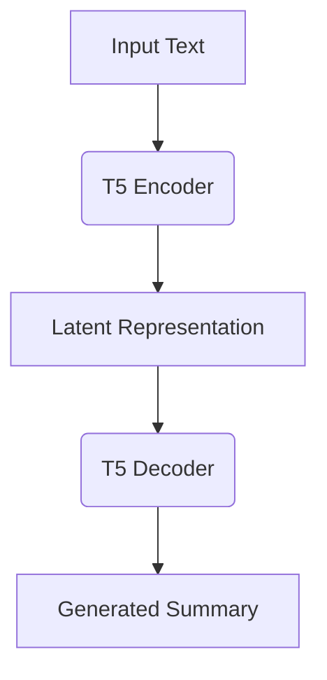

# 📝 Summarization NLP: AI-Powered Text Distillation 🚀

[](https://opensource.org/licenses/MIT)
[](https://www.python.org/)
[](https://huggingface.co/yxshee/t5-transformer)
[](https://www.tensorflow.org/)

> **"From Information Overload to Insightful Clarity"** ✨


## 🌟 Features

- 🎯 **Abstractive Summarization** - Generate human-like summaries with novel phrasing
- 📏 **Length Control** - Customize summary length via simple parameters
- 🌐 **Multilingual Support** - Process text in 44 languages (XL-Sum dataset)
- ⚡ **API Ready** - REST endpoints for seamless integration
- 🖥️ **Interactive Demo** - Web interface for instant experimentation

---

## 📚 Table of Contents

1. [📌 Project Overview](#-project-overview)
2. [📊 Dataset Insights](#-dataset-insights)
3. [🧠 Model Architecture](#-model-architecture)
4. [📈 Performance Evaluation](#-performance-evaluation)
5. [⚙️ Installation Guide](#️-installation-guide)
6. [🚀 Quick Start](#-quick-start)
7. [🌍 Deployment Options](#-deployment-options)
8. [🔮 Future Roadmap](#-future-roadmap)
9. [🤝 Contribution Guidelines](#-contribution-guidelines)
10. [📜 License](#-license)

---

## 📌 Project Overview


In an age of information overload, **Summarization NLP** acts as your AI-powered lens 🔍 to focus on what matters. Key capabilities:

✅ Convert lengthy documents to concise insights  
✅ Maintain original meaning through abstractive generation  
✅ Handle multiple languages effortlessly  
✅ Integrate via API into existing workflows  

**[Explore Model on Hugging Face](https://huggingface.co/yxshee/t5-transformer)** 🤗

---

## 📊 Dataset Insights

### 📦 XL-Sum Dataset Structure
```python
Dataset({
    features: ['id', 'article', 'summary'],
    num_rows: 300000
})
```

### 📝 Sample Data
| Article Excerpt | Generated Summary |
|-----------------|-------------------|
| "Recent stock market volatility linked to geopolitical tensions..." | "Geopolitical tensions cause stock market fluctuations, prompting investor caution." |
| "AI advancements revolutionize healthcare diagnostics..." | "Healthcare transformed by AI-driven diagnostic breakthroughs." |

---

## 🧠 Model Architecture

### T5 Transformer Overview


### 🏋️ Training Parameters
| Component              | Specification           |
|------------------------|-------------------------|
| Base Model             | T5-Small                |
| Optimizer              | AdamW (lr=3e-5)         |
| Batch Size             | 16                      |
| Training Epochs        | 5                       |
| Max Sequence Length    | 512 tokens              |

---

## 📈 Performance Evaluation

### 📊 ROUGE Scores
| Metric     | Score   | Visual               |
|------------|---------|----------------------|
| **ROUGE-1** | 0.238   | 🟢🟢🟢🟢🟢🟢⬜️⬜️⬜️⬜️ |
| **ROUGE-2** | 0.056   | 🟡🟡⬜️⬜️⬜️⬜️⬜️⬜️⬜️ |
| **ROUGE-L** | 0.122   | 🟠🟠🟠⬜️⬜️⬜️⬜️⬜️⬜️ |
| **ROUGE-Lsum** | 0.155 | 🔵🔵🔵⬜️⬜️⬜️⬜️⬜️⬜️ |

### 🔍 Sample Comparison
**Input:**  
*"Climate change impacts accelerate, with unprecedented Arctic ice melt reported..."*

**Generated Summary:**  
*"Rapid Arctic ice melt highlights accelerating climate change impacts."*

**Reference Summary:**  
*"Scientists report record Arctic ice loss due to climate change."*

---

## ⚙️ Installation Guide

### System Requirements
- Python 3.8+
- 8GB+ RAM
- 2GB+ Free Disk Space

### Setup Instructions
```bash
# Clone repository
git clone https://github.com/yxshee/summarization-nlp.git
cd summarization-nlp

# Create virtual environment
python -m venv .env
source .env/bin/activate  # Windows: .env\Scripts\activate

# Install dependencies
pip install -r requirements.txt

# Download model
python -c "from transformers import T5Tokenizer, TFT5ForConditionalGeneration; \
T5Tokenizer.from_pretrained('yxshee/t5-transformer'); \
TFT5ForConditionalGeneration.from_pretrained('yxshee/t5-transformer')"
```

---

## 🚀 Quick Start

### Python API Usage
```python
from summarizer import TextProcessor

processor = TextProcessor()
article = """[Insert long article text here]..."""

# Generate summary
summary = processor.summarize(
    text=article,
    max_length=150,  # 🎚️ Control summary length
    temperature=0.7  # 🎛️ Adjust creativity
)

print(f"📝 Summary:\n{summary}")
```

### Command Line Interface
```bash
python cli.py --text "Your input text here" --length 100
```

---

## 🌍 Deployment Options

### 🐳 Docker Deployment
```dockerfile
FROM tensorflow/tensorflow:2.8.0
COPY . /app
WORKDIR /app
RUN pip install -r requirements.txt
EXPOSE 5000
CMD ["python", "api_server.py"]
```

### ☁️ Cloud Deployment
1. **AWS SageMaker**  
2. **Google AI Platform**  
3. **Azure ML Services**  

---

## 🔮 Future Roadmap

- [ ] 🌐 Enhanced Multilingual Support
- [ ] ⚡ Real-Time Streaming API
- [ ] 🧩 Modular Architecture
- [ ] 📊 Advanced Analytics Dashboard
- [ ] 🔍 Explainable AI Features

---

## 🤝 Contribution Guidelines

**We Welcome:**  
🔧 Code Contributions  
🐛 Bug Reports  
💡 Feature Requests  
📖 Documentation Improvements  

**First Time?** Try our `good-first-issue` labeled tasks!

---

## 📜 License

This project is licensed under the **[MIT License](LICENSE)** - see the [LICENSE](LICENSE) file for details.

---

<div align="center">
  Made with ❤️ by YXSHEE | 📚 Transform Text into Knowledge!
</div>
